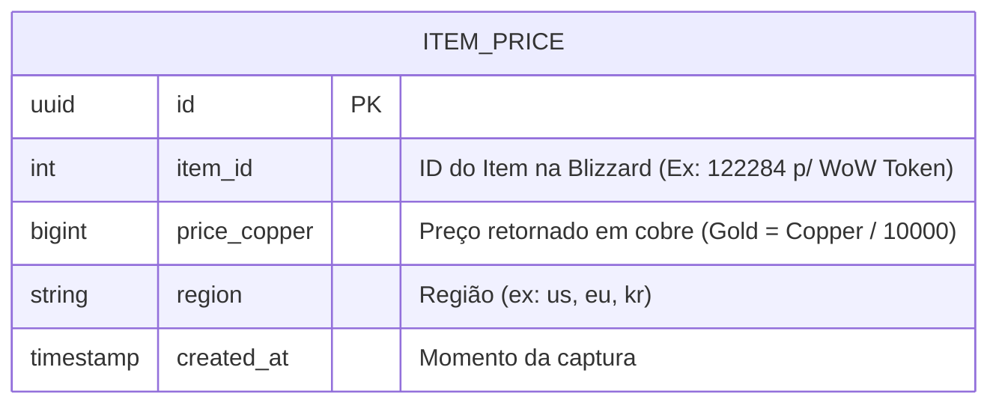

# Data Model: wow-token-price

## Entity Relationships

O sistema conta com um único schema central otimizado para gravações rápidas de série temporal (Time-Series) focado no tracking de preços regionais.

## Entity Specifications

### `ITEM_PRICE`

Entidade central da funcionalidade, onde todos os dados de rastreamento são anexados para consulta futura. O banco PostgreSQL foi escolhido pois no futuro permite fácil adaptação para extensões de timeseries, como `TimescaleDB`, ou integrações com ferramentas on-top como Grafana.

**Attributes:**

| Name | Type | Key | Required | Default | Description |
|------|------|-----|----------|---------|-------------|
| `id` | UUID | PK | Yes | `uuid_generate_v4()` | Identificador único do registro (Primary Key) |
| `item_id` | Integer | IDX | Yes | None | O ID oficial do item na Blizzard. O wow token é mapeado internamente para o ID 122284. |
| `price_copper` | BigInt | - | Yes | None | Preço base extraído sem formatação. Gold = Copper / 10000. BigInt é mandatório pois os valores de cobre facilmente excedem o Integer limit de 32bit. |
| `region` | String | IDX | Yes | `us` | Código de 2 letras atrelando a que macro regiao do jogo o registro de leilão pertence. |
| `created_at` | Timestamp | IDX | Yes | `CURRENT_TIMESTAMP` | Momento exato que a verificação de preço foi guardada na base de dados. |

**Constraints & Validation:**
- `price_copper` MUST be >= 0.
- `region` MUST be standard locale strings length (ex: VARCHAR(5)). 

**Indexes:**
- Composite index on `(item_id, region, created_at)` para otimizar os comandos de `ORDER BY created_at DESC` e filtros de dashboard rápido por item e região, que fatalmente serão os mais comuns neste tipo de banco de dados.

## State Transitions
Não aplicável para essa feature. Este é um dado de *append-only* (somente inserção em Time-Series). Registros de preços do passado nunca devem ser mutados sob nenhuma circunstância de negócio.
